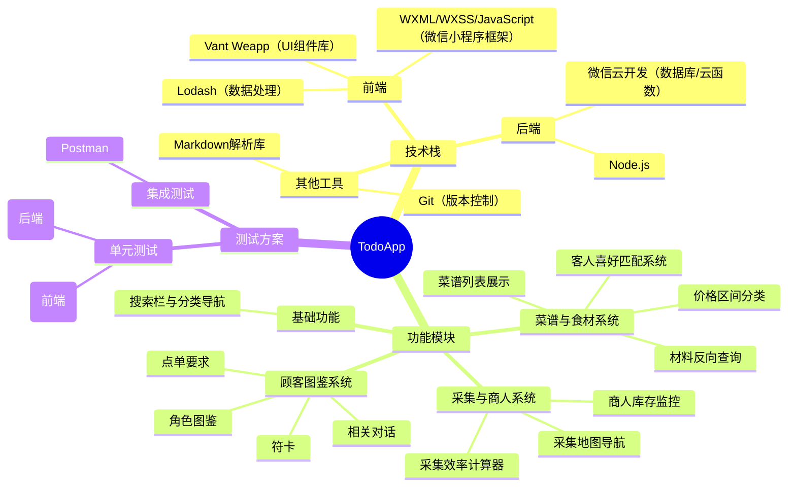

# 东方夜雀食堂wiki

## 项目介绍

本项目是一个基于​	微信小程序 / WXS响应式编程开发的关于游戏《东方夜雀食堂》的Wiki百科，后端使用微信云开发（数据库+云函数），其主要功能是：
- 采集与商人系统
- 菜谱与食材系统
- 顾客图鉴系统

## 小组成员及分工

| 姓名                                | 学号         | 分工                     |
| ----------------------------------- | ------------ | ------------------------ |
| [吴浥人](https://github.com/heiseisunset) | 2212190113 | 前端核心开发+扩展模块    |
| [金逸胜](https://github.com/RheinXenon)     | 2212190110 | 后端服务+基础设施        |

## 项目结构

