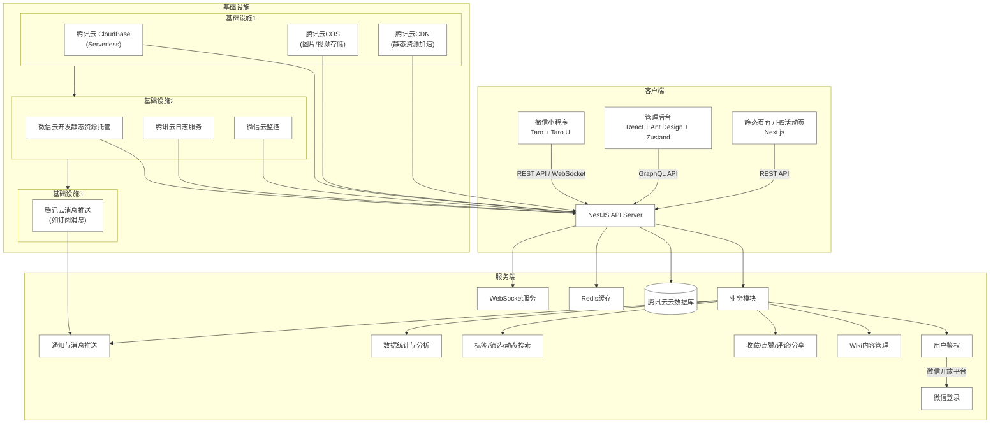
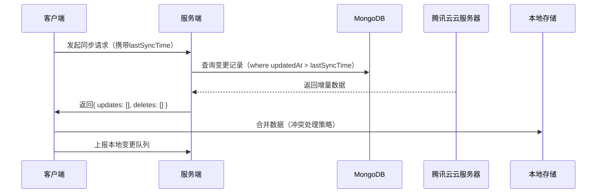
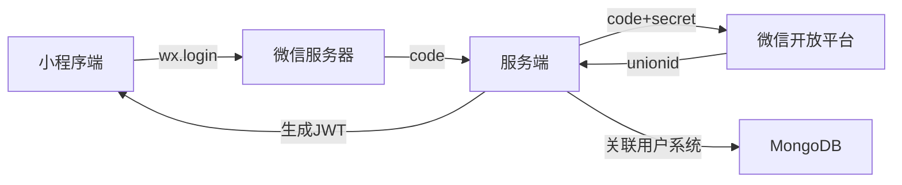
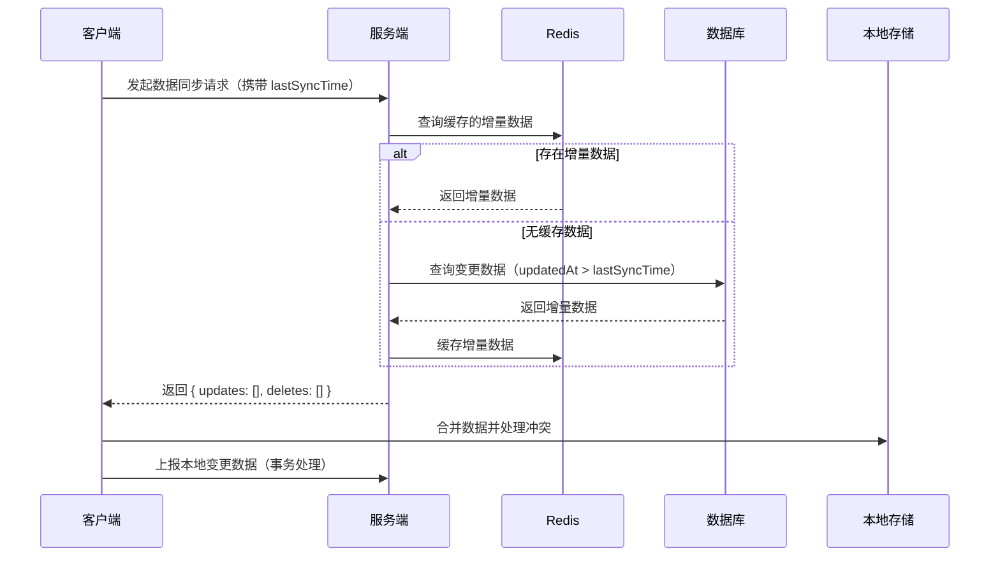
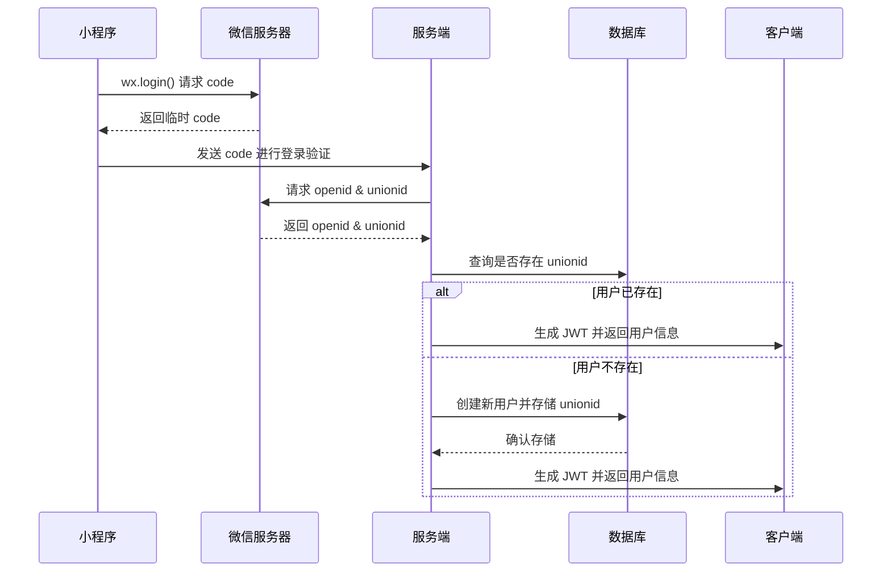

# 系统架构

## 技术栈选择依据：

1. **服务端**：
- **NestJS**：基于 TypeScript，提供模块化架构，内置依赖注入，适用于大型后端系统。支持 REST API、GraphQL、WebSocket，满足 Wiki 及社交功能需求。
- **腾讯云云数据库**: 适用于存储非结构化的 Wiki 内容，支持灵活的标签、筛选、动态搜索。
- **Redis**：用于缓存高频访问的 Wiki 文章、标签筛选结果，加速查询，提高 API 响应速度。
- **JWT + 微信 UnionID**：实现跨端用户体系，结合微信开放平台进行用户鉴权，确保数据安全性。
- **WebSocket**：用于实时通知、消息推送（如评论回复、点赞更新），提升互动体验。

2. **Web端**：
- **React 18**：使用函数组件 + Hooks，提升开发体验和可维护性。
- **Ant Design**：企业级 UI 组件库，适用于管理后台（Table、Form、Modal）。
- **Zustand**：轻量级状态管理库，比 Redux 更易用，适用于后台管理系统的数据状态管理。
- **Next.js**：用于 H5 页面，支持 SSR（服务器端渲染），提高 SEO 友好性，同时提升页面加载速度。
- **GraphQL API**：管理后台采用 GraphQL，减少 API 端点数量，提高数据获取的灵活性。

3. **移动端（微信小程序）**：
- **Taro 3**：基于 React 语法，支持多端（微信小程序、H5、React Native），统一前端开发体验。
- **Taro UI**：一款适配小程序的 UI 组件库，简化开发，提高 UI 适配性。
- **WXS（微信小程序扩展语法）**：用于优化性能关键路径，如处理大规模数据渲染。
- **REST API + WebSocket**：REST API 提供 Wiki 文章数据，WebSocket 用于实时评论、点赞、分享等社交交互。

4. **云基础设施**：
- **腾讯云 CloudBase（Serverless）**：提供自动扩展的 Serverless 计算，减少运维成本，适用于 Wiki 轻量级后端。
- **腾讯云 COS（对象存储）**：用于存储 WebP 格式的动态加载图片，降低服务器负担，提高加载速度。
- **腾讯云 CDN**：加速静态资源（如小程序图片、H5 页面），优化用户访问体验。
- **腾讯云数据库（MongoDB）**：提供稳定的 NoSQL 存储，适用于复杂的标签筛选和动态内容管理。
- **腾讯云日志服务**：用于记录 API 访问日志、错误日志，方便调试和监控。
- **腾讯云监控**：监控服务端 API 运行状态，预警异常情况。
- **腾讯云消息推送（如订阅消息）**：用于发送用户通知，如新评论、点赞提醒等。

## 关键架构设计：

1. **数据同步方案**：

2. **微信登录流程**：

3. **性能优化措施**：
   - **CDN加速**：静态资源部署到OSS
   - **分页加载**：Todo列表无限滚动
   - **Web Worker**：复杂计算（如Todo统计分析）
   - **差分同步**：仅传输变更数据

## 关键架构设计（重构后）

### 1. **数据同步方案**
为保证客户端数据的实时性，同时减少 API 负载，采用**增量同步**机制，仅同步自上次同步后的变更数据。

- **Redis 缓存**：存储近期的增量数据，减少数据库查询负载。
- **事务同步**：客户端提交本地变更时，后端以事务方式写入数据库，确保一致性。
- **冲突解决策略**：
  - **时间戳优先**：较新的数据覆盖旧数据。
  - **字段级合并**：对于支持并发编辑的字段（如 Wiki 文章），仅更新特定变更部分。

---

### 2. **微信登录流程**
微信登录采用 **JWT + 微信 UnionID** 机制，确保用户身份唯一性，并支持跨平台登录。

- **JWT（JSON Web Token）**：用于用户身份认证，每次请求时携带，减少数据库查询压力。
- **UnionID**：确保同一用户在不同端（小程序、H5、PC）共用同一个账号。
- **Token 刷新**：使用 Refresh Token 机制，避免用户频繁登录。

---

### 3. **性能优化措施**
为了优化 API 响应速度和前端交互体验，采取以下措施：

#### **静态资源优化**
- **腾讯云 CDN**：缓存 Wiki 文章图片、静态页面，减少服务端请求压力。
- **腾讯云 COS**：存储 WebP 格式图片，减少流量消耗，提高加载速度。
- **资源预加载**：对于访问量较高的文章，在小程序启动时预加载关键资源。

#### **数据查询优化**
- **Redis 缓存热门内容**：
  - 热门 Wiki 文章、点赞数、评论数存入 Redis，避免频繁查询数据库。
  - 采用 **LRU（Least Recently Used）** 策略管理缓存，确保高效利用内存。
- **MongoDB 复合索引**：
  - 对**筛选/动态搜索**功能创建索引，提升查询效率。
  - **ElasticSearch**（未来可扩展）：用于全文检索，提高搜索体验。

#### **数据分页与懒加载**
- **Wiki 文章分页加载**：防止一次性加载过多数据，减少前端渲染压力。
- **瀑布流加载**：用于动态内容，如**评论列表**、**点赞列表**，仅加载视口内内容。

---

### 4. **未来优化方向**
- **支持 GraphQL 订阅**：用于管理后台，实现数据的**实时更新**。
- **引入 AI 推荐**：
  - 通过用户行为分析，提供**个性化 Wiki 推荐**。
  - 结合 NLP 技术，提高搜索的**语义匹配**能力。
- **Serverless FaaS（如 Cloud Functions）**：
  - 处理计算密集型任务（如数据分析）。
  - 自动扩展，无需维护服务器。
