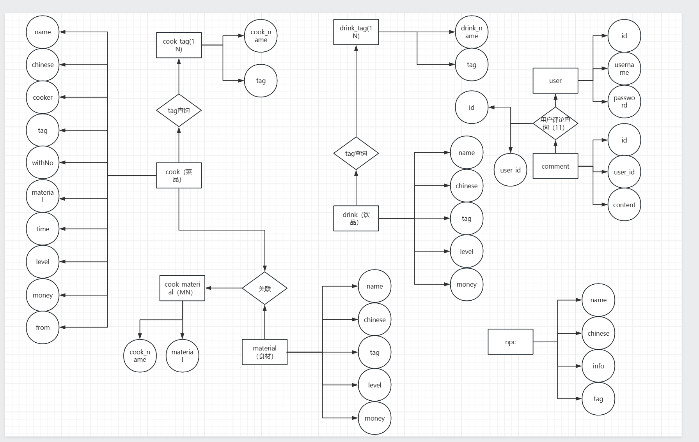

## 前后端与测试开发进度预览

# 后端数据库设计 

根据json数据的格式设计了后端数据库，完成wiki基本数据的存储与关联；在数据基础上拓展账户管理与评论管理的数据库与关联数据库，支持实现简单的账户注册、登录、评论发布删除管理功能。
ER图如下： 

  

  

# 新增接口
新增账户管理与评论管理相关接口：  
1.用户注册URL​​: /api/register  
    ​​Method​​: POST  
    Request Body​​:  
    {  
        "username": "string",  
        "password": "string"  
    }  
    成功返回样例：  
    {  
        "code": 200,  
        "message": "注册成功",  
        "data": {  
            "user_id": 1,  
            "username": "testuser"  
        }  
    }  
  
2.用户登录​​URL​​: /api/login  
    ​​Method​​: POST  
    Request Body​​:  
    {  
        "username": "string",  
        "password": "string"  
    }  
    成功返回样例：  
    {  
        "code": 200,  
        "message": "登录成功",  
         "data": {  
            "user_id": 1,  
            "username": "testuser"  
        }  
    }  
    失败返回样例：  
    {  
        "code": 401,  
        "message": "用户名或密码错误"  
    }  
  
3.发表评论URL​​: /api/comments  
    ​Method​​: POST  
    Request Body​​:  
    {  
        "content": "这个NPC真有趣"  
    }  
    成功返回样例：  
    {  
        "code": 200,  
        "message": "评论成功",  
        "data": {  
            "comment_id": 1,  
            "user_id": 1,  
            "username": "testuser",  
            "content": "这个NPC真有趣",  
            "created_at": "2023-07-20T10:00:00Z"  
        }  
    }  
    失败返回样例：  
    {  
        "code": 401,  
        "message": "未授权，请先登录"    
    }  
    
4.获取评论列表URL​​: /api/comments  
    Method​​: GET  
    成功返回样例：  
    {  
        "code": 200,  
        "message": "获取成功",  
        "data": [  
        {  
            "comment_id": 1,  
            "user_id": 1,  
            "username": "testuser",  
            "content": "这个NPC真有趣",  
            "created_at": "2023-07-20T10:00:00Z"  
        },  
        {  
            "comment_id": 2,  
            "user_id": 2,  
            "username": "user2",  
            "content": "我也喜欢这个角色",  
            "created_at": "2023-07-20T11:00:00Z"  
        }  
        ]  
    }  
  
5.删除评论URL​​: /api/comments/{comment_id}  
    Method​​: DELETE  
    成功返回样例：  
    {  
        "code": 200,  
        "message": "删除成功"  
    }      
      
# 测试方案  
📝 H5应用自动化测试文档  

✨ 测试概述  
🔍 测试范围：  
• 🖼 基础布局渲染  

• 🔄 Tab栏功能交互  

• 📊 数据筛选功能  

• 🔗 页面跳转功能  

• ⚙ 设置页面功能  

• 🚨 组件异常检测  

🌐 测试环境  
📱 浏览器：Chromium  
📦 测试框架：Playwright v1.16+  
🏠 被测地址：http://localhost:8080  
⚡ 执行模式：Headless  

🔧 测试用例说明  

1⃣ 基础布局验证  
🔍 测试步骤：  
1. 加载应用根路径  
2. 验证元素：  
   • 🧩 NPC列表容器(.npc-area)  

   • 🏷 地区筛选标签(.tag-filter)  

   • 🖼 有效NPC图片(img[src*="/static/img/npc/"])  

✅ 预期结果：  
✅ 页面基本元素渲染正常  

2⃣ Tab栏功能验证  
🔍 测试步骤：  
1. 点击「料理」Tab → 验证容器(.cook-div) + 条目(.cook-bar[data-type="cook"])  
2. 点击「饮料」Tab → 验证筛选器(.drinks-tag) + 条目(.cook-bar[data-type="drink"])  
✅ 预期结果：  
✅ Tab切换功能正常  

3⃣ 筛选功能验证  
🔍 测试步骤：  
1. 点击「全部」地区标签  
2. 等待500ms → 统计NPC数量  
✅ 预期结果：  
✅ 地区筛选正常（当前NPC数量：X）  

4⃣ 详情页跳转验证  
🔍 测试步骤：  
1. 点击首个NPC → 验证详情页(.npc-item-info + 标题「人物详情」)  
2. 返回列表页  
✅ 预期结果：  
✅ 详情页跳转正常  

5⃣ 设置页面验证  
🔍 测试步骤：  
1. 进入设置页 → 验证「重启应用」按钮  
✅ 预期结果：  
✅ 设置页面渲染正常  

6⃣ 组件异常检测  
🔍 验证内容：  
1. 名称非空检测  
2. 图片路径有效性  
✅ 预期结果：  
✅ 组件数据加载正常（通过）  

📊 测试结果汇总  
📋 基础布局 → 通过 🟢  
📋 Tab交互 → 通过 🟢  
📋 数据筛选 → 通过 🟢  
📋 页面跳转 → 通过 🟢  
📋 设置页面 → 通过 🟢  
📋 组件完整性 → 通过 🟢  

📌 测试结论  
所有核心功能验证通过！✨  
⚠ 建议关注：  
1. 服务器响应速度（500ms筛选等待）  
2. NPC图片资源维护  
3. 空数据兜底显示  

⏱ 测试执行时间：{{实际执行时间}}  
👤 测试人员：{{执行人}}
