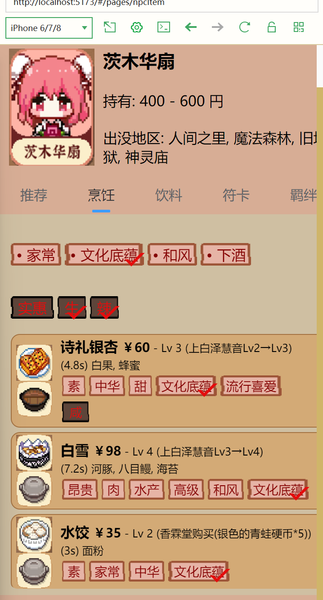
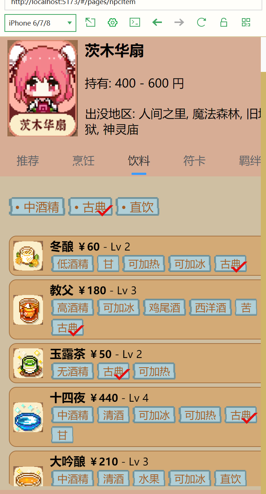
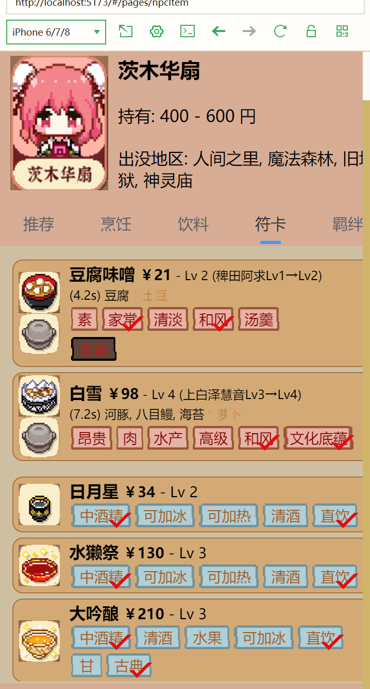
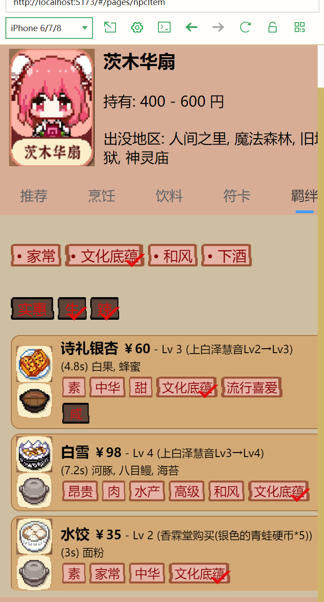
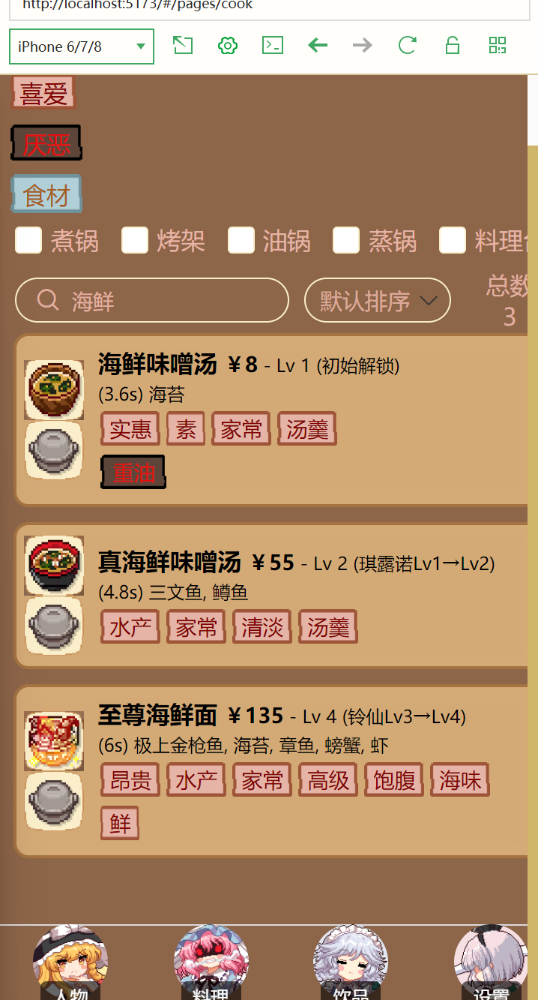
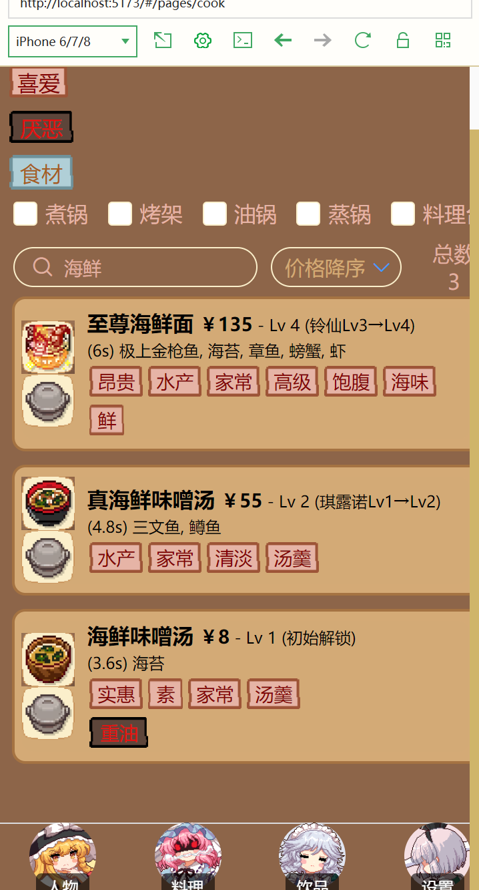
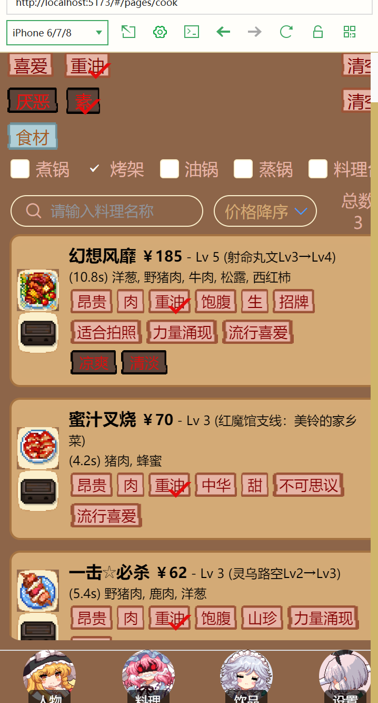
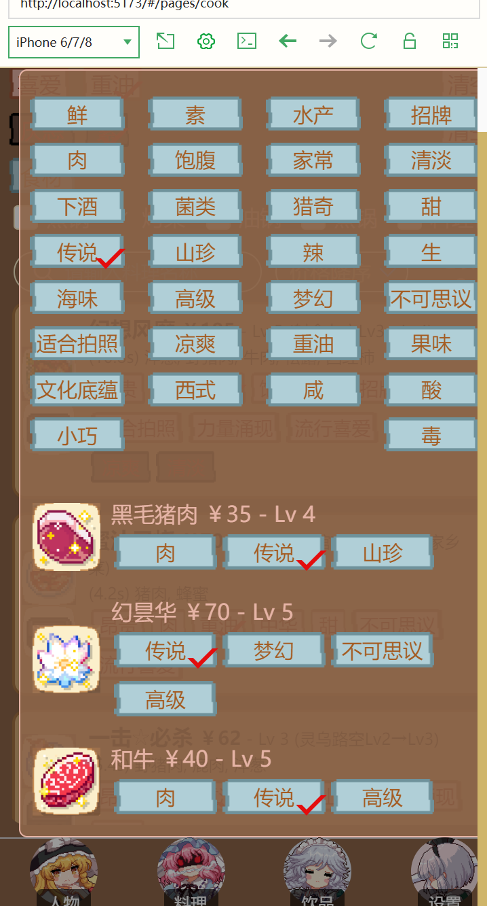
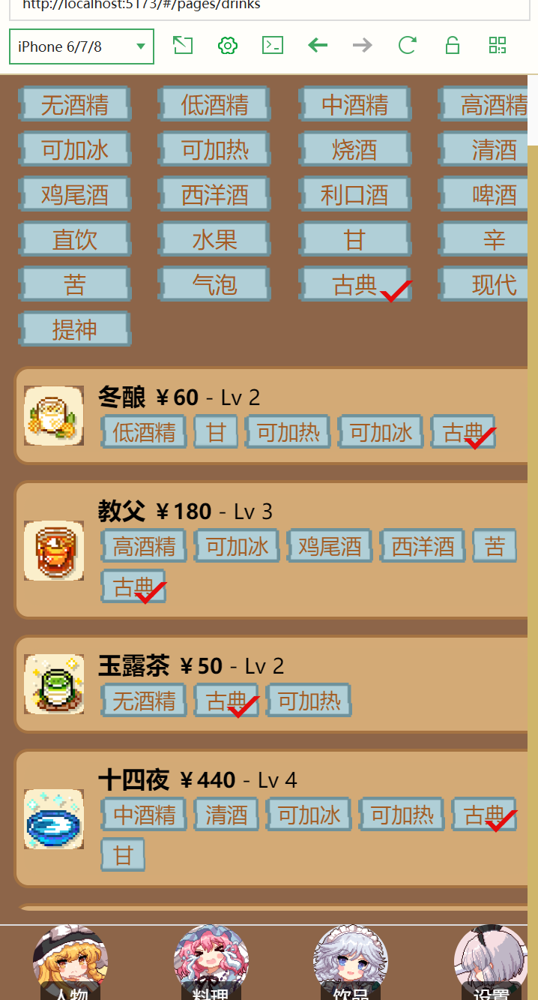

# 简介

Greetings!

开发中，一会儿也不一定补上

## 当前进度预览

以下是当前开发进度以及预览图：  

完成了人物详情界面内个性信息栏的烹饪、饮料、符卡、羁绊信息展示与筛选    

  
  
  
  

  

完成了料理界面的喜好、厌恶、食材筛选，料理工具筛选，排序方式，搜索系统与总数显示    

  
  
  
  

  

完成了饮品界面的标签筛选    

  

  

## 未来进度计划  

以下是未来进度规划：  

## 关注千早爱音喵！ 关注anon tokyo谢谢喵！
anon tokyo诚招摄影师

